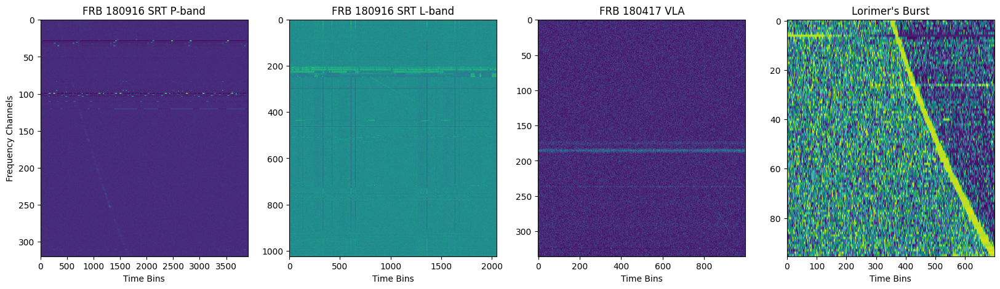
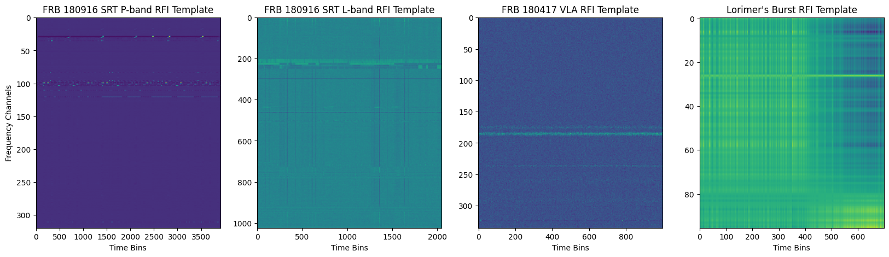
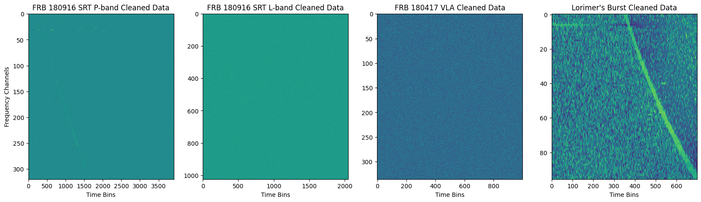

# seti_klt

  

Tools for applying the Karhunen-Loève Transform (KLT) to SETI radio observations, developed as part of my BSc thesis in Physics.

> **Applicazione della trasformata di Karhunen-Loève per la ricerca di segnali telemetrici extraterrestri**
> Giovanni Nicola D'Aloisio — Laurea Triennale in Fisica, Università di Napoli "Federico II", A.A. 2024/2025

## Table of contents

* [Overview](#overview)
* [Scripts](#scripts)
* [Environment](#environment)
* [External sources](#external-sources)

## Overview

This work was carried out during an internship at the Osservatorio Astronomico di Cagliari, within the **Breakthrough Listen** project, using data from the Sardinia Radio Telescope (SRT), Green Bank Telescope (GBT) and Parkes Observatory.

The KLT (proposed for SETI by Claudio Maccone in the 1990s) decomposes a stochastic signal into an optimal eigenbasis, making it effective at isolating strong, narrowband radio-frequency interference (RFI) from the noise floor — RFI that would otherwise mask faint, Doppler-drifting technosignatures. Here the KLT is integrated into the `turboSETI` pipeline as a pre-cleaning step, operating on filterbank (`.fil`) data.

The method was validated on archival data (bright FRBs, Voyager 1) and tested on ON-OFF observations of exoplanet targets such as TOI-1422 b (SRT, C-band 5.7-7.7 GHz and K-band 18.5-18.8 GHz), with synthetic technosignatures injected via `setigen` to quantify detection performance before and after KLT cleaning.







## Scripts

| Script | Description |
|---|---|
| `01a_test_env.py` | pytest suite checking conda env, Python/library versions, and basic functionality of numpy, scipy, astropy, setigen, your, blimpy |
| `01b_set_env.sh` | activates the `klt` conda environment and runs `01a_test_env.py` plus a smoke test on a sample filterbank |
| `03a_clean_filterbank.py` | core cleaning script: spectral-kurtosis RFI flagging and/or KLT-based RFI template subtraction (PCA on the covariance matrix, `-var_frac` controls the eigenvalue threshold, `-klt_win` sets the channel window) |
| `03b_run_klt_from_list.sh` | runs `03a_clean_filterbank.py -klt` over a list of filterbank files |
| `03c_run_cleaning.sh` | example invocations of `03a_clean_filterbank.py` with fixed parameters on stored experiment data |
| `04_compare_filterbanks.py` | checks whether two filterbanks contain the same data (regression testing) |
| `05a_signal_injector.py` | injects synthetic technosignatures into a filterbank, either via `setigen` or a custom `FakeTelemetry` Gaussian-drift model |
| `05b_setigen_for_klt.sh` | example runs of `05a_signal_injector.py` (setigen and telemetry-simulation modes) |
| `07_run_plotting.sh` | batch-runs `08_plot_data.py` over all `.fil` files in a directory for a set of channel ranges |
| `08_plot_data.py` | plots a filterbank waterfall (with optional time/frequency range selection) |
| `11_check_hits.sh` | computes the average number of `turboSETI` hits per target from `.dat` output files |
| `13_run_turboseti.sh` | runs `turboSETI` on a list of filterbank files |
| `14_check_memory.sh` | reports current RAM usage on the observation server |

## Environment

Python 3.11.4, conda env `klt`. Key dependencies: `astropy`, `blimpy`, `your`, `sigpyproc`, `setigen`, `turbo-seti`, `numpy`, `scipy`, `matplotlib`.

```bash
unset PYTHONPATH
source /opt/conda/bin/activate klt
```

## External sources

* <https://thepetabyteproject.github.io/your/0.6.6/ipynb/Reader/>
* <https://sigproc.sourceforge.net/sigproc.pdf>
* <https://sigproc.sourceforge.net/>
* <https://docs.astropy.org/en/stable/coordinates/index.html>
* <https://blimpy.readthedocs.io/en/latest/overview.html>
* <https://turbo-seti.readthedocs.io/en/latest/>
* C. Maccone, *The KLT (Karhunen-Loève Transform) to extend SETI searches to broad-band and extremely feeble signals*, Acta Astronautica 67 (2010) 1427-1439
